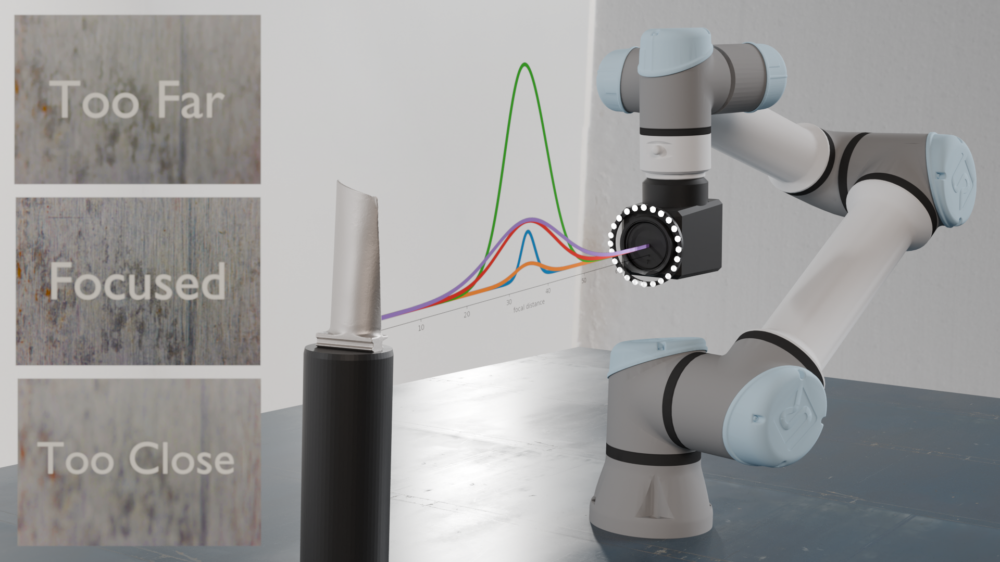
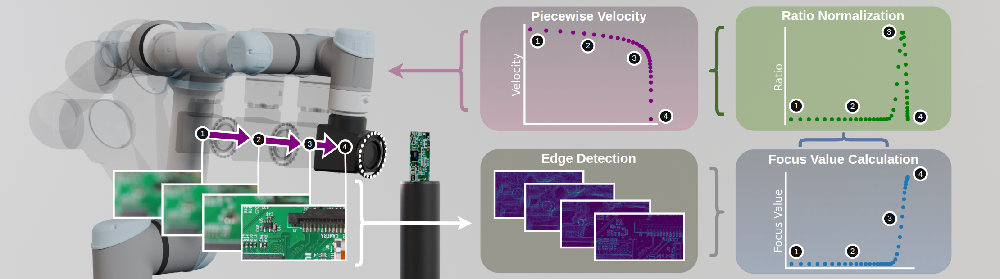
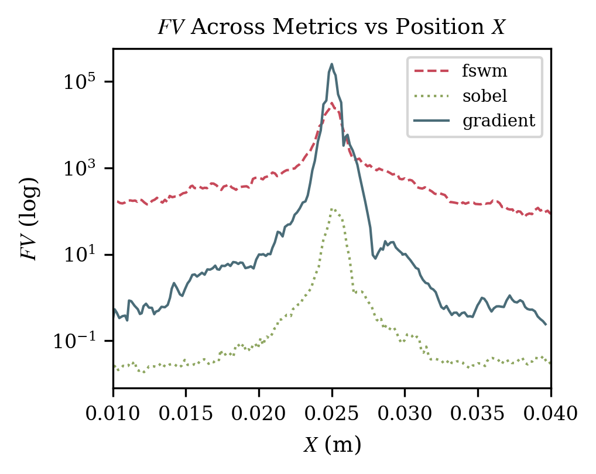
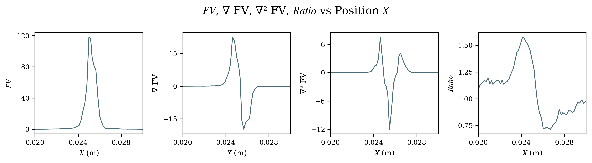
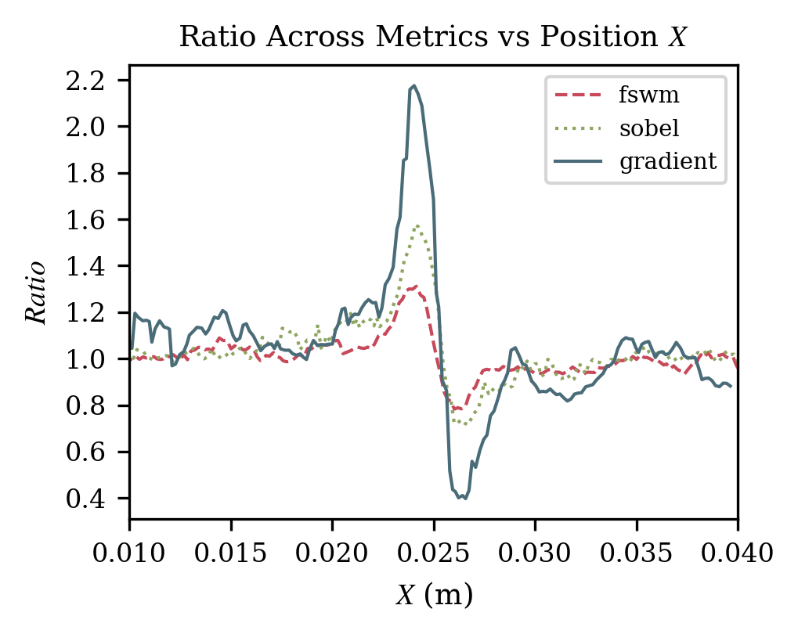
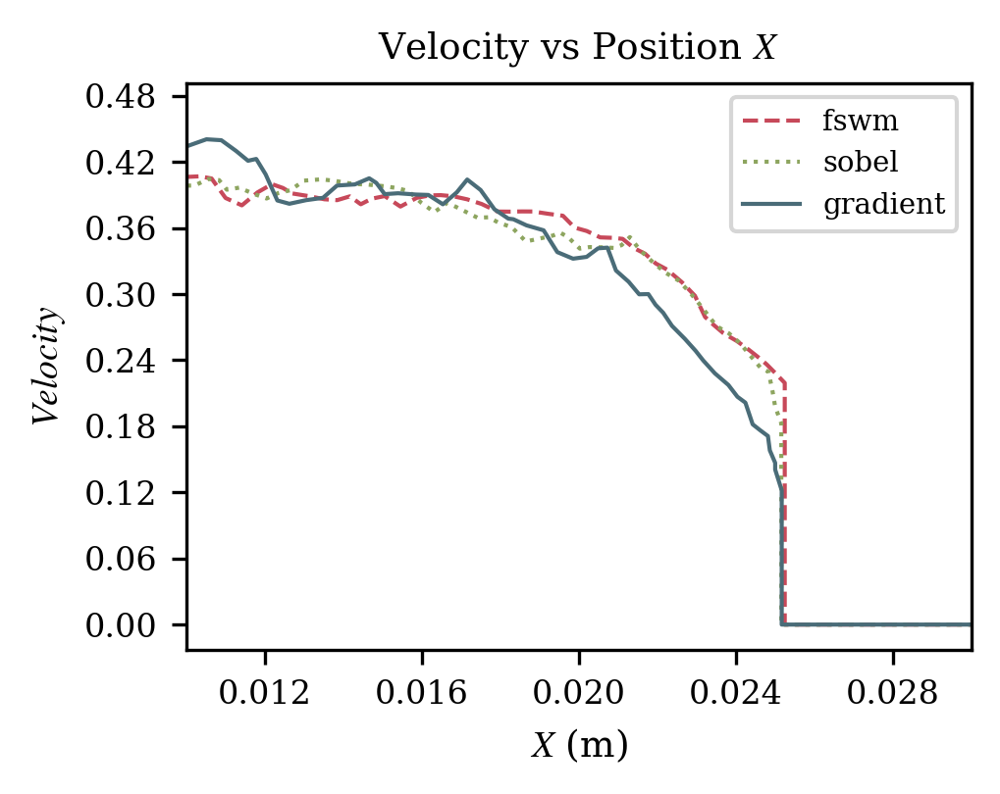
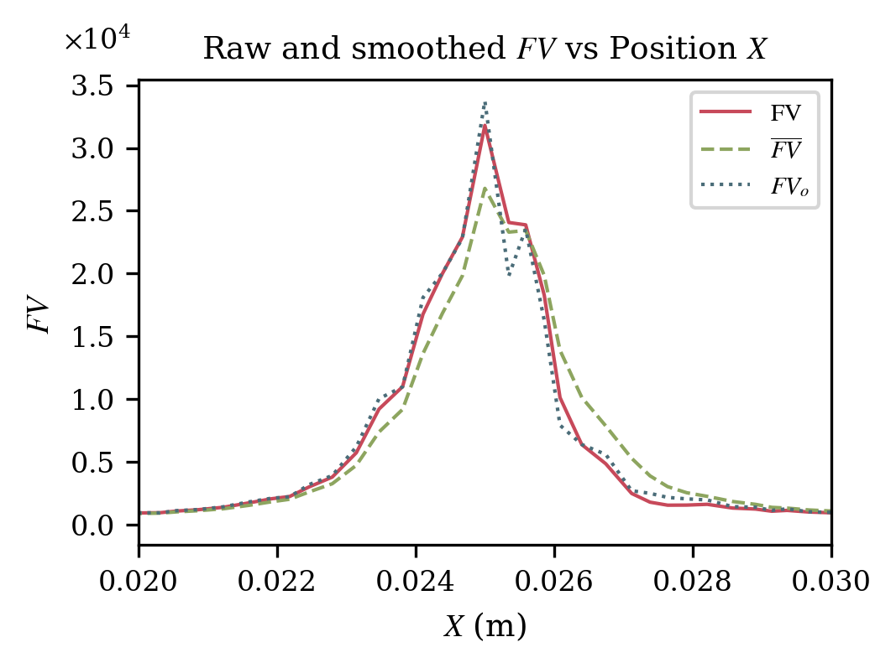
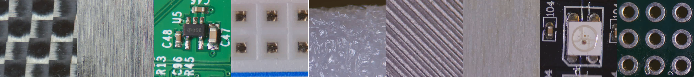
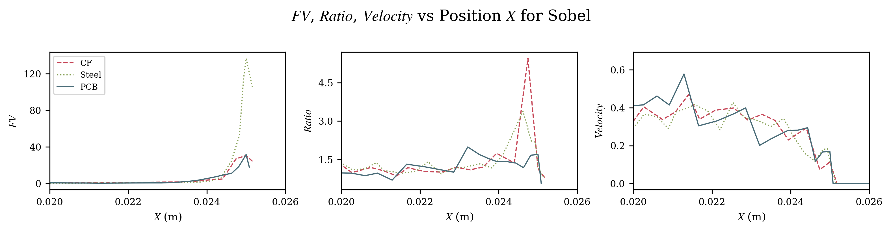

# Robotic Autofocus Algorithm for Visual Inspection in Precision Manufacturing Using Focus Value and Ratio-Based Velocity Control

**Amy Santoso¹⁻², Colin Acton¹⁻², Sangyoon Back², Xu Chen²⁻³**

¹: equal contribution  
²: Authors are with the MACS lab, Department of Mechanical Engineering, University of Washington, Seattle, WA 98195, USA. {esantoso, actonc, sangyo1, chx}@uw.edu  
³: corresponding author

---

## Abstract

Rising precision requirements in manufacturing are motivating the shift from error-prone manual inspection to automated solutions. This paper presents a ratio-based, visual servoing autofocus method for robotic macro imaging that accurately functions across multiple focus metrics without requiring system recalibration. Compared to the exhaustive hill climb method, our system achieves the maximum focus position in less than 25% of the time while maintaining 2 mm accuracy on textured, low reflectivity surfaces and 4 mm for smooth or highly reflective surfaces. The effectiveness of the algorithm is verified on materials commonly found in industrial inspection scenarios. The versatility of the algorithm across diverse materials and lighting conditions makes it a promising solution for industrial robotic inspection, offering a flexible and robust means to improve quality control processes.

---

## 1. Introduction

Quality control and inspection are vital for meeting strict manufacturing standards, from tight tolerances to visual perfection. The automotive industry has been implementing more automation in its assembly and manufacturing processes. However, sectors with high-mix, low-volume production have been slower to adopt these technologies [1, 2]. Aircraft component manufacturing, an important sector within the aerospace industry, is an example where many sub-processes still rely on manual operations with substantial gaps in system integration and material handling, motivating further research and development [3].

In aerospace and precision manufacturing, components often feature complex geometries, tight spatial constraints, variable composite material properties, and stringent tolerances, all of which increase the difficulty of inspection. As a result, human inspectors can miss up to 25% of defects in precision enterprise-scale tasks [4]. In the short term, automation reduces inspection time and minimizes production bottlenecks, as automated machines take less than 40% of the time required by a human inspector [5] and can be 17% more accurate than the aforementioned human inspection limit [6], thereby improving defect detection time and reducing the need for costly rework. In the long term, automation reduces cost, with an estimated 40% reduction per component related to labor and material utilization [3]. Given the complexity of the manufactured components and the stringent tolerances involved, automation benefits such as cost reduction, improved accuracy, and time savings make automated inspection a key priority in aerospace engineering.

<figure>  <figcaption><i>Figure 1: Experimental setup consisting of a UR5e manipulator, Sony IMX477 image sensor, macro lens, and lighting system. Focus value plots are overlaid along the camera's principal axis with image examples at different focal distances.</i></figcaption> </figure>

A range of inspection methods is used in practice, including—but not limited to—dimensional, radiographic, and visual inspection. In this work, we concentrate on visual inspection, aiming to develop a reliable autofocus method that enables robots to consistently acquire sharp and accurate images. The central challenge is maintaining accurate and consistent focus across diverse environments, materials, and component geometries while preserving constant magnification, which is essential for reliable geometric information in long-term data preservation and downstream data processing. Because in-lens autofocus changes the optical focal length—and thus the magnification—we cannot rely on the camera's internal focusing mechanism. Instead, the robot needs to adjust arm movement to ensure consistently clear images.

<figure>  <figcaption><i>Figure 2: Illustration of the autofocus control loop, showing image-based feature extraction and ratio-based feedback that regulate lens velocity. Edge features are extracted from each captured image to compute a focus value. The ratio of consecutive focus values drives a piecewise velocity function with four characteristic regions: (a) flat focus curve with inverse velocity response, resulting in high velocity; (b) transitional region where velocity decreases as focus improves; (c) fine mode where velocity scales with a bounded ratio to increase sampling density; and (d) final convergence as the ratio returns to one.</i></figcaption> </figure>

The focus value ($FV$), defined as the sharpness of the image, is a non-smooth function that contains extensive flat regions and a narrow peak. Common optimization methods such as Newton's method [7] and Bayesian optimization [8] are suboptimal for identifying the peak in robotic autofocus control. Newton's method is sensitive to noise and highly dependent on the initial guess, which serves as the starting point to iteratively move toward the optimal focus position. If Newton's method initializes in the flat areas of the $FV$ curve or the non-smooth region, the system easily fails to converge to the optimal focus position. In addition, no analytic form of $FV$ exists for computing the gradient and Hessian of $FV$ in diverse inspection scenarios. Bayesian optimization also assumes a smooth objective function that matches the Gaussian Process kernel assumptions and typically requires tuning for a single object and environment, which reduces the algorithm's versatility. In addition, Bayesian optimization struggles with the flat regions and narrow peaks in the $FV$ curve (see, e.g., Figs. 4 and 7), which leads to unreliable approximated focus positions. Due to these limitations, both methods do not address the challenges of real-time, robust autofocus in diverse visual inspection scenarios.

To address these shortcomings, this paper proposes a novel data-driven adaptive autofocus framework that integrates multiple interchangeable focus metrics to provide adaptability for various visual inspection requirements, improve overall inspection efficiency, and reduce the number of recalibration that is key for industrial implementation.

We develop a novel, ratio-based feedback robot control to realize the mechanical autofocus movement and reduce the time required to obtain a focused image (Fig. 2). Ratio control is commonly used in mixing applications to maintain the relationship between parameters [9-13]. Our proposed method repurposes ratio control and uses the ratio of focus values as a control input, enabling integration across multiple focus metrics regardless of their differing scales or magnitudes. Then, our algorithm constructs a customized velocity control scheme that yields smooth yet highly responsive robot arm commands. Closely related, Bevec et al. [5] proposed a velocity-based autofocus algorithm that integrates coarse and fine search modes and demonstrated performance approximately twice as fast as that of a human operator. However, their approach has not been investigated in the context of robotic inspection, where the need to inspect multiple points and objects introduces substantial variability in the magnitude of the focus value. Moreover, such methods remain largely unvalidated in precision manufacturing settings, in which maintaining consistent focus under diverse surface textures and lighting conditions is critical—conditions that our work explicitly addresses. Building on literature results, our ratio-based algorithm scales velocity using $FV$ ratio to deliver consistent performance across different materials, metrics, and environments. Our method achieves accuracy comparable to the exhaustive hill climb (EHC) autofocus search method [14, 15], which serves as a common benchmark in the domain, while significantly reducing the process time.

The proposed methods have been verified with an imaging system mounted on a UR5e robot, shown in Fig. 1. The system accounts for the pose of the end-effector and generates viewpoints to capture images from a 3D scan of the part [16, 17]. With the camera positioned at a set viewpoint, image sharpness is quantified using a $FV$ derived from the high frequency information present in the frame. The magnitude of $FV$ is dependent on the surface texture, rough surfaces such as unpolished steel yield higher $FV$ than smooth surfaces, such as carbon fiber. Utilizing a macro lens and 12.3MP Sony IMX477 sensor, the system maintains consistent image magnification and focus by robotic arm manipulation rather than in-lens adjustments to ensure consistently clear images.

The main contributions of this paper are: (i) the development of a novel ratio-based robotic autofocus algorithm that operates effectively across multiple focus metrics and materials without the need for recalibration, (ii) a comprehensive evaluation of various focus metrics under consistent conditions across different materials to assess their robustness and reliability, and (iii) demonstration of high-precision autofocus capability, achieving sub-millimeter accuracy on textured materials and 4 mm precision on smooth surfaces.

The remainder of this paper is organized as follows. Sections 2 and 3 present the ratio-based autofocus algorithm, followed by experimentation and benchmarking in Sections 4 and 5. Section 6 concludes the paper.

---

## 2. Focus Value Formulation

The basis of our algorithm depends on $FV$, which quantifies the sharpness of the features in an image and computed using computer vision. $FV$ is plotted in relation to the focal distance which typically results in a bell-shaped curve, and the peak corresponds to the optimal focus position. Three commonly used metrics exist to evaluate $FV$: variance of Sobel, squared gradient (SG), and frequency-selective weighted median (FSWM). Variance of Sobel handles noise effectively but has reduced sensitivity to fine edges. SG is more sensitive to edges but may amplify noise. FSWM offers strong robustness to noise and preserves edge details using frequency-selective weighted median filtering; however, it is computationally more expensive and may have reduced sensitivity to features from imaging conditions and parameter tuning [18-22]. These distinct characteristics highlight the need to balance robustness and adaptability of the autofocus system across various environments and materials.

### 2.1. Variance of Sobel Metric

The Sobel operator estimates the first derivative of an image intensity, defined as pixel brightness values, in the horizontal and vertical axes by convolving the image with fixed kernels [23, 22]. The derivatives are combined to approximate the gradient magnitude of each pixel, representing local edge strength. Distinct edges produce larger Sobel values, which become more pronounced as focus improves and $FV$ increases toward a local or global peak. This gradient-based approach is robust to Gaussian noise because it primarily responds to high-frequency edge components rather than low-frequency noise. The overall $FV$ is then calculated as the variance of these gradient magnitudes across the image, where higher variance indicates increased edge contrast and therefore better focus.

### 2.2. SG Metric

The SG metric follows the Sobel operator, where the gradients are computed and squared. The $FV$ is then obtained by summing these SG magnitudes across the entire image [18, 13, 22]:

$$FV = \sum_{x,y} \left( G_x(x,y)^2 + G_y(x,y)^2 \right) ,,$$

where $G_x$ and $G_y$ represent the horizontal and vertical gradients, respectively.

### 2.3. FSWM

FSWM filtering uses weighted median operations, where each pixel in a local window (e.g., $3\times3$), is assigned a spatial weight. The weighted median is obtained by sorting the window intensities and selecting the value where the cumulative weight exceeds half the total value. Multiple weighted median outputs are then linearly combined:

$$F = y(i, j) = \sum_{k=1}^{M} \alpha_k \langle W_k, I_k \rangle,,$$

where $\langle W_k;I_k \rangle$ is the weighted median output. The overall $FV$ is computed as the variance of the filtered image

$$FV = \sum_{i} \sum_{j} \left[ F_x(i,j)^2 + F_y(i,j)^2 \right],,$$

where $F_x$ and $F_y$ are the FSWM outputs in the horizontal and vertical axes, respectively. The FSWM suppresses impulsive noise, random pixel outliers with extreme intensity values, while preserving edges [24, 25]. As a result, FSWM is adaptable in dynamic imaging scenarios with impulsive noise, but it may be less sensitive to small focus variations.

---

## 3. Proposed Ratio-Based Autofocus Algorithm

Existing autofocus approaches primarily rely on discrete position control [13, 14]. Precision imaging and inspection in manufacturing, however, demand smooth transient motion; broader inspection modalities, such as streaming video and ultrasonic inspection, also fundamentally depend on consistent and stable end-effector motion. Accordingly, we adopt a velocity control strategy to enable smoother, more responsive robot motion tailored to precision manufacturing applications.

<figure>  <figcaption><i>Figure 3: Log-scale comparison of FV obtained via FSWM, Sobel, and SG metrics on an unpolished steel surface. The wide range of FV hinders consistent focus algorithm tuning across multiple metrics.</i></figcaption> </figure>

However, as illustrated in Fig. 3, focus metrics can vary widely in both magnitude and dynamic range, which makes direct velocity control based on $FV$ impractical without frequent recalibration. To address this challenge, we propose using the signs of the approximated first derivative $\nabla FV$ and second derivative $\nabla^2 FV$, together with a ratio-based formulation of $FV$, computed as follows:

$$\begin{split} \nabla FV[t] &= FV[t] - FV[t-1],, \ \nabla^2 FV[t] &= \nabla FV[t] - \nabla FV[t-1],, \ r[t] &= \frac{FV[t]}{FV[t-1]},. \end{split}$$

The signs of the $FV$ indicate when the focus curve is approaching the maximum $FV$ and guide switching between coarse and fine control modes, as shown in Fig. 4. Furthermore, the shape of the $FV$ curve remains consistent across metrics, making the sign a reliable indicator for mode switching.

<figure>  <figcaption><i>Figure 4: Plots of the focus value (FV), first derivative (∇FV), second derivative (∇²FV), and ratio plotted as a function of position for an unpolished steel surface using the variance of the Sobel metric as the focus measure.</i></figcaption> </figure>

To address differences in magnitude and dynamic range among focus metrics, we use the ratio of the current $FV$ with a moving average to tune the gain for velocity control. Fig. 5 shows this ratio constrains the dynamic range to a substantially narrower band, enabling adaptability across multiple focus metrics without specific tuning.

<figure>  <figcaption><i>Figure 5: The ratio comparison between FSWM, Sobel, and SG metrics on an unpolished steel surface shows a narrow range of values. This reduced variation enables ratio to be used as a control input across metrics and materials without retuning parameters for different environments.</i></figcaption> </figure> <figure>  <figcaption><i>Figure 6: Flowchart of the proposed autofocus control logic.</i></figcaption> </figure>

The proposed control scheme uses $FV$, its derivatives, and $FV$ ratio, and a nonlinear feedback velocity control algorithm as detailed in the flowchart in Fig. 6. At the core, the velocity control operates in two main phases: the coarse mode followed for fast actuation, followed by the fine mode for precision control, and a final correction for minor overshoot from the fine mode, ensuring that the algorithm finishes at the optimal focus position. We characterize the control modes with:

$$v[t] = \begin{cases}\frac{k_v}{r[t]} & , \nabla FV[t] > 0 \wedge \nabla^2 FV[t] > 0,, \ k_v r[t] & , \nabla FV[t] > 0 \wedge \nabla^2 FV[t] < 0,, \ 0 & , \nabla FV[t] = 0 \wedge \nabla^2 FV[t] < 0 ,. \end{cases}$$

Here, $r[t] = \frac{FV[t]}{FV[t-1]}$ as defined in Eq. (1), and parameter $k_v$ is an unitless scaling factor directly correlating to the velocity magnitude, set to an adjustable constant parameter to balance speed with operational safety.

<figure>  <figcaption><i>Figure 7: Velocity profiles for FSWM, Sobel, and SG focus metrics on unpolished steel using the proposed ratio-based autofocus algorithm. The x-axis shows shorter travel distance as the method stops shortly after reaching optimal focus, where velocity drops to zero. The results show that the narrower range of ratio values corresponds to consistent velocity profiles across metrics without parameter retuning.</i></figcaption> </figure>

We initiate the system in a single, forward direction, starting from the far end of the $FV$ curve. The ratio-based autofocus algorithm begins with a coarse search characterized by positive first and second derivatives of the $FV$ ($\nabla FV>0$ and $\nabla^2 FV>0$), indicating that the $FV$ is increasing and accelerating positively. During this phase, the ratio begins low and increases as the system approaches the optimal $FV$. Velocity follows $v[t] = \frac{k_v}{r[t]}$, so a lower ratio at the start corresponds to a higher velocity, enabling a fast sweep through regions far from the optimal $FV$. Fig. 7 shows velocity is highest at the initial position during the coarse mode, and Fig. 4 demonstrates a low ratio at the start. The control mode switches to the fine search mode when $\nabla FV>0$, indicating the $FV$ is still increasing, with $\nabla^2 FV<0$, but the system is nearing the optimal focus position.

During the fine search mode, $\nabla^2 FV$ continues to decrease and becomes more negative, while $\nabla FV$ remains positive with decreasing magnitude. Since the focus ratio is decreasing, finer adjustments are required, so the system adjusts the velocity which is proportional to the focus ratio, $v[t] = k_v r[t]$. Therefore the velocity decreases as the system approaches the optimal $FV$, shown in Fig. 7. As $\nabla FV$ approaches zero, $\nabla^2 FV$ reaches its minimum, indicating the system has reached the maximum $FV$.

However, variations on inspected surfaces can induce noise on the raw $FV$. These variations can cause fluctuations on the ratio, $\nabla FV$, and $\nabla^2 FV$. We address this by implementing a double exponential moving average (DEMA) to smooth the $FV$ data. The post-processed data is formulated as

$$\begin{align} \overline{FV}[t] &= \alpha_1 FV_o[t] + (1-\alpha_1) \overline{FV}[t-1],, \ \overline{\overline{FV}}[t] &= \alpha_2 \overline{FV}[t] + (1-\alpha_2)\overline{\overline{FV}}[t-1],, \ FV[t] &= 2\overline{FV}[t] - \overline{\overline{FV}}[t] ,, \end{align}$$

where $FV_o$ is the raw $FV$ data, $\alpha_1, \alpha_2\in(0,1)$ are the smoothing parameters. We employ DEMA from Eq. (5) by combining Eqs. (3) and (4) to reduce lag observed in the exponential moving average (EMA). As shown in Fig. 8, DEMA not only yields a better smoothing and noise reduction but also preserves the location of the optimal $FV$.

<figure>  <figcaption><i>Figure 8: Comparison of the raw focus value (FV_o) and DEMA filtered focus value (FV) used in the control algorithm on unpolished steel material, measured using the FSWM focus metric.</i></figcaption> </figure>

---

## 4. Experimental Results

We tested the proposed algorithm on an in-house developed inspection cell consisting of a UR5e robotic manipulator, and a custom, eye-in-hand imaging system composed of a Sony IMX477 image sensor, macro lens, and individually addressable LED ring. This experimental setup is illustrated in Fig. 2. We used a magnification of $0.18\times$, resulting in an approximate focus distance of 30 centimeters. Data was collected at 30 fps in 1080p.

ROS2 was used to facilitate communication between hardware, with MoveIt2 Servo to calculate the inverse kinematics to translate real-time velocity commands into joint trajectories. Nine materials were selected for the testing: carbon fiber, unpolished steel, PCB, breadboard, foam, PLA print, wood, LED strip, and solder board. These samples encompass a range of visually diverse surfaces, with objects displaying varying texture levels and reflectivity, as shown in Fig. 9.

<figure>  <figcaption><i>Figure 9: From left to right: carbon fiber, unpolished steel, PCB, breadboard, foam, PLA print, wood, LED strip, and solder board. These materials exhibit different surface characteristics, such as carbon fiber showing a glossy finish with minimal textures, unpolished steel being highly reflective with a slight grain, and PCB being distinctly textured.</i></figcaption> </figure>

Two experimental sets were conducted. The first set used the proposed ratio-based autofocusing, while the second set used the exhaustive hill climb (EHC) algorithm as a benchmark. EHC uses a constant velocity approach, whereas the ratio-based algorithm incorporates a faster coarse mode when the camera is far from the optical focus position. For the ratio-based method, the velocity gain was set to $k_v=0.4$. For EHC, $k_v$ was set to half this value to match the velocity during its fine scanning mode.

Each set of experiments were repeated to test three focus metrics: FSWM, Sobel, and SG. All objects were placed 15 cm away from the end effector to maintain consistent starting conditions for the autofocus runs.

**Table 1: Time performance (in seconds) of the proposed ratio-based velocity control $t_{\text{ratio}}$ and EHC $t_{\text{EHC}}$ across different materials and focus metrics.**

|Material|Metric|$t_{\text{ratio}}$|$t_{\text{EHC}}$|% ΔTime Improv.|
|---|---|---|---|---|
|**Carbon Fiber**|FSWM|**6.167**|28.733|78.537|
||Sobel|**5.567**|28.833|80.692|
||SG|**5.668**|28.833|80.346|
|**Steel**|FSWM|**5.667**|29.000|80.459|
||Sobel|**5.966**|29.100|79.495|
||SG|**5.767**|28.300|79.622|
|**PCB**|FSWM|**5.634**|29.367|80.817|
||Sobel|**5.833**|28.667|79.652|
||SG|**5.934**|28.367|79.081|
|**Breadboard**|FSWM|**5.400**|28.499|81.052|
||Sobel|**5.500**|28.500|80.701|
||SG|**5.899**|28.400|79.226|
|**Foam**|FSWM|**5.505**|28.812|80.894|
||Sobel|**5.816**|28.423|79.537|
||SG|**5.902**|28.401|79.220|
|**PLA Print**|FSWM|**5.711**|28.031|79.627|
||Sobel|**5.603**|28.821|80.560|
||SG|**5.218**|28.002|81.365|
|**Wood**|FSWM|**5.102**|28.110|81.851|
||Sobel|**4.313**|28.512|84.847|
||SG|**5.137**|28.124|81.734|
|**LED Strip**|FSWM|**5.900**|28.700|79.442|
||Sobel|**6.000**|29.500|79.660|
||SG|**5.799**|28.400|79.578|
|**Solder Board**|FSWM|**6.018**|29.403|79.532|
||Sobel|**5.507**|29.397|81.265|
||SG|**6.203**|30.099|79.391|

Table 1 shows that the ratio-based autofocus algorithm achieves >75% time improvement across all tested materials and focus metrics. Table 2 summarizes the accuracy results. Breadboard, carbon fiber, foam, and PLA print all have accuracy within 2 mm, close to the absolute position accuracy limit of the robot. LED strip, PCB, unpolished steel, wood, and solder board have accuracy within 4 mm. When using the FSWM metric, the maximum position error is 1.990 mm. For the variance of Sobel metric, it is 3.693 mm, and for the SG metric, it is 2.967 mm. The corresponding average errors are 0.845 mm, 1.560 mm, and 1.315 mm, respectively. Table 3 compares maximum $FV$ and ratios, showing $r[t]$ remains below 10 across all materials and metrics. This compresses the range by over 90% relative to $FV$, enabling smoother velocity scaling without metric-specific tuning.

**Table 2: Maximum focus position (mm) between the proposed ratio-based velocity control and EHC across focus metrics and materials, where $d_{\text{FSWM}}$, $d_{\text{Sobel}}$, and $d_{\text{SG}}$ denote the maximum focus position difference for each focus metric.**

|Material|$d_{\text{FSWM}}$|$d_{\text{Sobel}}$|$d_{\text{SG}}$|
|---|---|---|---|
|Carbon Fiber|0.856|1.009|0.793|
|Steel|0.670|2.239|1.644|
|PCB|0.713|2.496|1.851|
|Breadboard|0.364|0.027|1.221|
|Foam|1.013|0.061|0.935|
|PLA Print|1.990|0.134|0.557|
|Wood|0.282|1.968|2.966|
|LED Strip|1.472|2.258|0.257|
|Solder Board|0.245|3.630|1.610|

**Table 3: Maximum ratio and achieved FV across metrics and materials.**

|Material|Metric|Max Ratio|Max FV|
|---|---|---|---|
|**Carbon Fiber**|FSWM|**1.597**|3342.1|
||Sobel|**5.458**|30.6|
||SG|**4.303**|15368.7|
|**Steel**|FSWM|**2.071**|21259.8|
||Sobel|**3.389**|137.0|
||SG|**8.476**|280238.6|
|**PCB**|FSWM|**2.340**|2564.6|
||Sobel|**1.988**|31.7|
||SG|**2.837**|7154.1|
|**Breadboard**|FSWM|**1.707**|1451.1|
||Sobel|**3.341**|4.2|
||SG|**2.758**|4735.6|
|**Foam**|FSWM|**2.313**|4420.8|
||Sobel|**5.223**|23.0|
||SG|**5.630**|3151.5|
|**PLA Print**|FSWM|**2.139**|13170.4|
||Sobel|**9.148**|211.3|
||SG|**7.037**|14476.8|
|**Wood**|FSWM|**3.428**|839.8|
||Sobel|**3.767**|4.3|
||SG|**9.747**|278.7|
|**LED Strip**|FSWM|**1.710**|6965.1|
||Sobel|**3.094**|40.8|
||SG|**3.511**|19034.9|
|**Solder Board**|FSWM|**1.792**|17173.8|
||Sobel|**1.897**|6.525|
||SG|**6.510**|282015.3|

<figure>  <figcaption><i>Figure 10: Comparison of (FV), ratio, and velocity results computed using the variance of Sobel focus metric for carbon fiber, unpolished steel, and PCB, plotted against position. All FV peaks have been shifted to align at 0.025 m, representing the standardized maximum focus position. The velocity rapidly decreases after the transition to fine mode, reflecting the algorithm's shift to more precise adjustments.</i></figcaption> </figure>

Fig. 10 shows the $FV$ computed using the variance of Sobel focus metric, the corresponding focus ratio, and the commanded velocity for three materials: carbon fiber, unpolished steel, and PCB. The $FV$ curves indicate that unpolished steel produces significantly higher $FV$ than the other two materials. In contrast, the focus ratio remains <10 for all materials, demonstrating that the ratio reduces variability between materials relative to the $FV$. Similar trends are observed for other focus metrics, which are summarized in Table 3.

---

## 5. Impact of Material Characteristics

We have tested the performance of the proposed autofocus algorithm across multiple materials and focus metrics. The substantial (>75%) time improvement of the proposed method is similar across all nine materials, suggesting that the ratio-based velocity control is largely insensitive to surface appearance in terms of convergence speed. The position data show that positional accuracy depends more strongly on surface finish than on the choice of focus metric, with textured, low-reflectivity surfaces maintaining small deviations from the EHC baseline and smoother or more reflective surfaces exhibiting larger focus errors.

These differences are consistent with the underlying material characteristics. Highly reflective or sparsely textured surfaces, such as LED strip, unpolished steel, solder board, and wood, provide weaker gradient information and therefore lead to larger position errors. Materials with smooth surfaces but strong intensity variation, such as carbon fiber, yield stronger gradients and therefore higher focus accuracy. Breadboard, foam, and PLA print combine strong textures with low reflectivity, allowing for more definitive focus ratios.

The fluctuations observed in the ratio and velocity curves indicate noise and variability in the image data potentially from robot motion, illumination changes, or sensor noise. By using DEMA, the autofocus algorithm maintains robust performance despite some observed noise, operating effectively without recalibration. Table 3 shows that maximum $FV$ vary widely with material, whereas the corresponding maximum ratios remain within a bounded range. For example, the Sobel metric yields maximum $FV$ between 4.2 to 211.3, while the corresponding ratios stay between 1.897 to 9.148. The SG metric shows $FV$ spanning from 278.7 to over $2.8\times10^5$, yet ratios remain <10. The ratio parameter effectively reduces the impact of large variations in $FV$, promoting system stability across various materials and environments.

Despite constraints on reachability and computational resources, the proposed ratio-based velocity control achieved high precision and reliable focus across all tested materials, indicating that the ratio formulation is effective under realistic hardware and cycle‑time limitations.

---

## 6. Conclusion

In this paper, we proposed a ratio-based autofocus algorithm and validated it on a UR5e robotic arm equipped with a Sony IMX477 image sensor and a macro lens. The results demonstrate that the algorithm reliably operates across multiple focus metrics and diverse surface materials without requiring recalibration by compressing the range of $FV$ as a ratio. The ratio parameter makes the approach highly robust for diverse and dynamic inspection environments.

Future work includes reducing noise to produce a smoother ratio and tuneable velocity control profiles to improve precision and stability, particularly on smooth surfaces.

---

## References

[References would be listed here based on the bibliography file]

---

## Biographies

**Elizabeth Amy Santoso** received the M.S. and B.S. Degree in Mechanical Engineering from Carnegie Mellon University and the University of Colorado Boulder, respectively. She is currently a PhD student at the University of Washington, Seattle, WA, United States. Her research interests include robotics, mechatronics, and manufacturing.

**Colin Acton** received the B.S. Degree in Mechanical Engineering from University of California, Berkeley. He is currently a PhD student at the University of Washington, Seattle, WA, United States. His research interests include robotics, mechatronics, inspection, and manufacturing.

**SangYoon Park** received the B.S. and M.S. Degrees in Mechanical Engineering from University of Washington. His research interests include robotic inspection and applications.

**Xu Chen** received the bachelor's degree (Hons.) from Tsinghua University, China, in 2008, and the M.S. and Ph.D. degrees in mechanical engineering from the University of California, Berkeley, CA, USA, in 2010 and 2013, respectively. He is currently an Associate Professor and holds the Bryan McMinn Endowed Research Professorship with the Department of Mechanical Engineering, University of Washington, Seattle, WA, USA. His research interests include dynamic systems and controls, information fusion, advanced manufacturing, and intelligent robotics. Dr. Chen is a recipient of the U.S. National Science Foundation CAREER Award, the SME Sandra L. Bouckley Outstanding Young Manufacturing Engineer Award, and the Young Investigator Award from the ISCIE/ASME International Symposium on Flexible Automation.