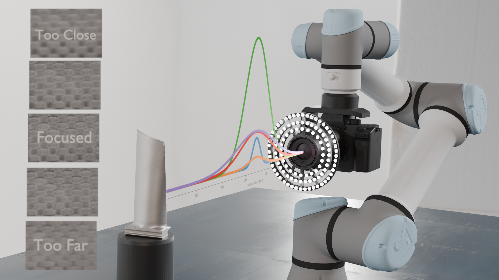
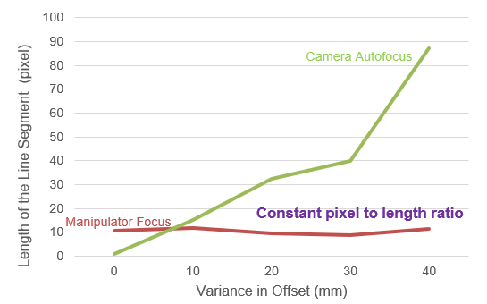

# Optimal Focus Metrics for Passive Autofocus, Robotic Visual Servoing and Precision Visual Inspection

**Authors:** SangYoon Back*, Colin Acton*, Amy Santoso, Xu Chen†  
**Affiliation:** University of Washington  
3900 E Stevens Way NE, Seattle, WA 98195  
{sangyo1, actonc, esantoso, chx}@uw.edu  
*Equal contribution; †Corresponding author.

## Abstract

High-precision inspection in manufacturing demands consistently sharp, high-resolution images to detect microscopic defects critical to product quality and safety. Traditional in-lens autofocus systems, however, often introduce positional errors and scale variances—issues that are exacerbated when using macro lenses with shallow depths of field. This paper presents an integrated solution that combines a novel focus metric with a robotic manipulator autofocus algorithm to overcome these limitations.

A comprehensive evaluation of several focus metrics—including variants based on Sobel operators, Laplacian filters, and frequency-domain techniques—revealed that a weighted combination of the Mixed Sobel operator and the Frequency Selective Weighted Median (FSWM) filter provides a robust measure of image sharpness. This weighted Sobel+FSWM metric produces well-distributed Gaussian focus curves with high signal-to-noise ratios, demonstrating superior performance across diverse materials (reflective, matte, and transparent) and under varying lighting conditions.

Building on this finding, we integrated the focus metric into a real-time autofocus algorithm deployed on a UR5e robotic manipulator. The algorithm dynamically adjusts the camera's z-axis position while leveraging memory of previous optimal focus positions to significantly reduce adjustment time—from an initial 27 seconds to approximately 4.8 seconds per inspection pose. Experimental results confirm that our approach ensures consistent image scale and enhanced defect detection reliability, offering a cost-effective and efficient solution for automated industrial inspection systems.

## 1. Introduction

High-precision inspection is essential in manufacturing industries to ensure the reliability and quality of critical components. Industries such as aerospace, automotive, and electronics require strict quality control to detect defects that could compromise safety and performance. Traditional inspection methods rely on skilled human inspectors using manual tools such as calipers and micrometers; however, these methods have limitations, including human error, subjectivity, and physical strain. In precision manufacturing environments, studies have shown that manual visual inspection methods achieve an accuracy rate of only around 75%, which is inadequate for industry standards that often require detecting defects as small as 0.13–0.25 mm.

<figure>
  
  <figcaption><i>Figure 2: Experimental setup consisting of a UR5e manipulator, Sony mirrorless camera with macro lens, and lighting system. Focus value plots are overlaid along the camera's principal axis with image examples at different focal distances on the left.</i></figcaption>
</figure>

The use of a macro lens for robotic inspection is driven by the need for exceptional precision and magnification consistency. Macro lenses are critical for capturing the fine details required to identify microscopic defects; however, their shallow depth of field makes them highly sensitive to even slight deviations from the optimal focal distance. In-lens autofocus mechanisms alter camera magnification and introduce variance in the pixel-to-length ratio of collected image data, affecting the reliability of AI defect detection algorithms downstream and preventing metrology.

To address these limitations, robotic manipulator systems equipped with high-resolution imaging and vision-based focus control techniques have been implemented. These systems leverage the benefits of realtime, adaptive visual servoing and novel computer vision techniques to overcome the limitations of in-lens autofocus.

Comparative tests were conducted in which macro images of a marker-board were captured at various initial positional offsets ranging from 0mm to 40mm. As illustrated in Figure below, the robotic manipulator autofocus consistently maintains a stable image scale with differences bounded to a 10-pixel range, regardless of the initial positional error. In contrast, the in-lens autofocus system exhibited progressively larger deviations in pixel length as the positional offset increased, leading to significant alterations in image scale. This progressive change not only compromises dimensional accuracy but also jeopardizes the reliability of defect detection algorithms by potentially causing false positives or negatives.

<figure>
  
  <figcaption><i>Figure: Deviation in focus distance from target introduces variance in scale when using in-lens autofocus. Dynamically adjusting the camera's focus distance via real-time visual servoing with focus value feedback maintains feature scale.</i></figcaption>
</figure>

These results conclude that, although in-lens autofocus may provide faster focusing with increased initial offset, its susceptibility to positional errors and resultant scale variances makes it less suitable for high-precision tasks. In contrast, the manipulator focus algorithm, combined with high-resolution imaging and image processing techniques, offers the consistency necessary to support accurate and reliable automated inspection in critical applications.

A focus metric is a quantitative measure to assess image sharpness by analyzing local image characteristics at each pixel. These pixel-level measurements are typically computed using mathematical techniques such as gradient or derivative, then summed into a single numerical value, called the focus value, which quantifies the level of detail and clarity in the image.

To address the challenges posed by focus inconsistencies, a visual servoing focus control approach is proposed to achieve more accurate data acquisition. By experimenting with multiple focus metrics, the first major contribution of this paper is to quantitatively identify the optimal method for calculating focus values in cameras. Identifying the most effective focus metric allows for accurate determination of the maximum focus point or range, ensuring that the camera is optimally positioned to capture consistently sharp and well-focused images. This approach is critical when using high-resolution macro lenses with very shallow depth of field, where precise focus adjustments are essential to maintain image quality across a wide range of inspection scenarios.

Enhancing the focus calculation method not only improves the consistency and reliability of the inspection system but also yields highly accurate, robust images that are critical for training and deploying defect detection systems. By ensuring consistently well-focused images, the second major contribution of this paper is that the system minimizes the need for high-specification hardware or frequent retraining of machine learning models due to environmental changes, such as varying lighting conditions or different manufacturing environments. This approach makes the inspection process more efficient and less dependent on computational resources, facilitating implementation across various manufacturing settings without the need for expensive equipment. Furthermore, automated systems can perform inspections faster and more consistently than human inspectors, who may experience fatigue and variability in performance. By offering a practical and cost-effective solution that consistently provides high-quality images, the proposed method supports the advancement of automated inspection systems in the manufacturing industry, ultimately contributing to higher quality standards, increased productivity, and competitive advantages.

## 2. Summary and Analysis of Relevant Autofocus Methods and Focus Metrics

Achieving precise focus in automated imaging systems is essential for high-precision inspection tasks across various industries, including aerospace, automotive, electronics, and manufacturing. Consistently producing sharp and detailed images is vital for accurate defect detection, measurement, and quality control. Determining effective autofocus methods and focus metrics that guide algorithms to maintain optimal image sharpness remains a significant challenge.

### 2.1 Autofocus Systems

Autofocus systems enhance image clarity by adjusting focus through methods such as lens movement, image sensor positioning, and lighting modification. These systems are generally categorized into passive and active methods, each employing different strategies to determine the optimal focal setting.

**Passive Autofocus Methods** determine optimal focus by analyzing the captured image without requiring additional hardware or external distance measurements. These methods evaluate image sharpness using computational algorithms that process image data, adjusting focus to maximize a chosen focus metric. By analyzing features such as edges, textures, or frequency content, passive autofocus systems can achieve precise focus. This approach reduces system complexity and cost while maintaining accuracy, making it particularly suitable for high-precision inspection systems.

For example, Chen et al. proposed an image-based evaluation method for microscopic imaging that uses the sum-modified Laplacian (SML) focus measure. The SML emphasizes high-frequency components indicative of sharp focus by highlighting areas with significant intensity changes, making it particularly effective in microscopy where detecting fine details is crucial. In another study, Choi and Kim introduced a passive autofocus technique using the Frequency Selective Weighted Median (FSWM) filter for video cameras. The FSWM filter enhances focus measurement by reducing noise and preserving edge information, which is essential for accurate focus assessment in dynamic imaging environments such as surveillance and video recording. Similarly, Dimeo and Allen developed a fast and accurate autofocus control method that employs Gaussian standard deviation and gradient-based binning, combining statistical measures with gradient information to rapidly and precisely adjust focus. This approach is especially suitable for high-resolution imaging applications such as semiconductor wafer inspections.

Passive autofocus methods are advantageous in high-precision inspection environments due to their reliance on image data alone, eliminating the need for additional hardware. They are flexible and can be applied to various imaging scenarios, provided that appropriate focus metrics are selected and tailored to the specific characteristics of the images being analyzed. Due to these considerations, passive methods are generally preferred in high-precision inspection systems, aligning with the requirements of industries that demand precision without added complexity.

### 2.2 Evaluation and Selection of Focus Metrics

Focus metrics are quantitative measures that assess image sharpness and are essential in autofocus systems. The effectiveness of a focus metric depends on factors such as image content, noise levels, application-specific requirements, and material properties. Selecting an appropriate focus metric is crucial for achieving reliable and accurate focus in high-precision inspection tasks.

Prior studies have conducted extensive analyses of focus measure operators for various applications, highlighting that no single focus measure is universally optimal. Pertuz et al. evaluated a wide range of focus measures and identified methods like the Tenengrad, variance of the Laplacian, and wavelet-based measures as effective due to their high sensitivity to focus and robustness against noise. Mir emphasized that the effectiveness of a focus metric is highly dependent on the specific application and imaging environment, underscoring the necessity of experimenting with multiple focus measures to identify the most suitable one for a given task.

Building upon these studies and considering the specific requirements of the robotic inspection system, several focus metrics were selected, adapted, and combined for implementation and testing. The figure below displays the selected focus metrics including Second Derivative Sobel Operator, Squared Sobel Operator, Mixed Sobel Operator, Sobel-Laplacian Combination, Squared Gradient, FSWM Filter, and FFT Metrics.

<figure>
  
  <figcaption><i>Figure: From left to right: Original Image, Filtered Images of Second Derivative Sobel, Squared Sobel, Mixed Sobel, Sobel-Laplacian, Squared Gradient, FSWM, and FFT.</i></figcaption>
</figure>

These metrics are adaptations and combinations designed to fit the specific needs of the system, chosen due to their sensitivity to image sharpness, robustness against noise, and computational efficiency, making them suitable for real-time applications in industrial environments.

The **Second Derivative Sobel Operator** computes the variance of the Sobel-filtered image by applying the operator with dx=1 and dy=1 simultaneously, effectively calculating the second-order mixed derivative ∂²I/∂x∂y of the image intensity I. This method captures diagonal intensity changes, making it particularly sensitive to variations not apparent when considering horizontal and vertical gradients independently. By focusing on these mixed derivatives, it provides a comprehensive measure of image sharpness within the region of interest (ROI), highlighting combined edge information that contributes to sharper image regions.

The **Squared Sobel Operator** computes the squared gradient magnitude of the image intensity. After obtaining the first-order derivatives Gₓ(x,y) and Gᵧ(x,y) using the Sobel operator, the squared gradient magnitude is defined as:

G²ₛₒᵦₑₗ(x, y) = G²ₓ(x,y) + G²ᵧ(x,y)     (1)

Squaring the gradients is particularly effective in assessing image sharpness because edges and fine details correspond to significant changes in intensity, resulting in higher gradient magnitudes.

The **Mixed Sobel Operator** combines both the Squared Sobel Operator and the Second Derivative Sobel Operator to create a new focus measure metric. By adding the squared gradient magnitude and the second-order mixed derivative, it leverages the strengths of both methods, capturing prominent edges as well as diagonal intensity changes:

Gₘᵢₓₑₐ(x, y) = α√(G²ₓ(x,y) + G²ᵧ(x,y)) + β|∂²I/∂x∂y|     (2)

While combining these operators may introduce higher noise levels, the Sobel operator inherently possesses high noise tolerance. α and β are weights for combining two equations. This robustness ensures that the mixed metric remains effective in identifying the maximum focus position without significant disturbance, thereby maintaining accurate sharpness detection across various image features.

The **Sobel-Laplacian Combination** focus measure combines the edge detection capabilities of the Sobel operator with the zero-crossing detection of the Laplacian operator. The combination is calculated as:

Gᶜᵒᵐᵇⁱⁿᵉᵈ(x, y) = α·√(G²ₓ(x,y) + G²ᵧ(x,y)) + β·|∇²I(x, y)|     (3)

where ∇²I(x, y) is the Laplacian of the image intensity. This method enhances the focus measure by incorporating both edge strength and edge curvature information, improving sensitivity to image sharpness.

The **Squared Gradient** focus measure calculates the squared differences of adjacent pixels in both horizontal and vertical directions. After converting the input image to grayscale, finite differences between neighboring pixels along the x and y axes are computed, resulting in gradient estimates ΔₓI and ΔᵧI. These gradients are squared and combined:

G²ₘᵣₐ𝒹(x, y) = (ΔₓI)² + (ΔᵧI)²     (4)

The focus value is obtained by calculating the variance of G²ₘᵣₐ𝒹(x, y) within the ROI, effectively capturing edge information and fine details.

The **Frequency Selective Weighted Median (FSWM) Filter** focus measure applies a bandpass filter using the Difference of Gaussians approach to isolate specific frequency components of the image. By subtracting a Gaussian-blurred version of the image with a higher sigma value from one with a lower sigma value, it emphasizes features within a certain spatial frequency range. A weighting function that decreases with distance from the center is applied to the filtered image, giving more importance to central regions. The focus value is calculated as the variance of the weighted filtered image within the ROI, enhancing sensitivity to particular textures and features critical in inspection tasks.

The **Fast Fourier Transform (FFT)** focus measure assesses image sharpness by analyzing the frequency content of an image. The FFT is a mathematical algorithm that transforms an image from the spatial domain to the frequency domain, decomposing it into its constituent sinusoidal components of varying frequencies and orientations. This transformation allows for the examination of frequency components that correspond to image details of different scales.

In the context of autofocus, high-frequency components in the frequency domain represent fine details and sharp edges within the image, which are indicative of good focus. Low-frequency components, on the other hand, correspond to smooth variations and are less informative about sharpness. By emphasizing high-frequency content and suppressing low-frequency components, the FFT focus measure evaluates the degree of sharpness based on the presence of fine details.

In high-precision inspection systems, effective autofocus methods and carefully chosen focus metrics are crucial for detecting microscopic defects, reducing false positives or negatives, and ensuring efficient automation by minimizing manual adjustments. In industrial settings with real-time constraints and limited computational resources, simple first-principle focus metrics—such as intensity variance and gradient-based measures—are often preferred over complex machine learning approaches. Their computational efficiency, modest hardware requirements, and robustness make them ideal for reliably guiding subsequent defect detection algorithms.

Deep learning methods, while powerful, often require substantial computational resources and extensive training data specific to the application domain. They may introduce complexities in deployment and maintenance, such as the need for retraining when conditions change or dealing with variability in lighting and materials. By utilizing first-principle methods, the system ensures fast and reliable focus adjustment, consistently capturing well-focused images across diverse conditions. This approach supports real-time operation vital for industrial inspection tasks that demand high throughput and minimal downtime, while simplifying integration into existing systems and reducing overall cost and complexity.

## 3. Experimental Analysis

### 3.1 Experiment Setup

To evaluate the performance of the focus metrics in realistic industrial conditions, a robotic system equipped with a macro lens camera and an adjustable LED lighting array was employed. This setup is designed to perform high-precision inspection tasks common in aerospace and electronics manufacturing, where the detection of microscopic surface defects is critical.

The camera was mounted on the end-effector of a UR5e robot arm, allowing precise control over its position relative to flat test objects. At initialization, the camera was retracted to de-focus the image, ensuring it will not exceed the maximum focus point and thereby constraining the system to unidirectional motion. The robot then moved the camera along the z-axis within a range of ±2 cm from the optimal focus point, traversing different focus levels from out-of-focus to in-focus states.

During the focus adjustment process, the system operated in real-time, continuously computing focus values using selected focus metrics. Data were recorded at each timestamp, including the focus value and camera pose. After five sweeps, the camera moved to the position corresponding to the maximum focus value, indicating the point of optimal focus, and captured an image. This procedure ensured precise correlation between the focus measurements and the camera positions, enabling accurate assessment of each focus metric's effectiveness.

To assess robustness under varying conditions, the experiment was conducted five times for each focus metric in different materials. The materials tested included carbon fiber, carbon steel, glass, plastic, copper, acrylic, and cork, representing reflective, matte, and transparent objects commonly found in the manufacturing industry. Based on observations that defective objects tend to have higher focus values than non-defect objects (as shown in the figure below), the decision was made to test with non-defective samples. In real-world inspection scenarios, most components do not contain defects; thus, ensuring that focus metrics perform effectively on non-defective objects validates their applicability. If a focus metric provides well-focused images of non-defective objects, it is expected to perform equally well when defects are present.

<figure>
  
  <figcaption><i>Figure: Comparison of focus values for defective (left top, orange) and non-defective (left bottom, blue) carbon fiber objects using mixed Sobel metrics.</i></figcaption>
</figure>

An adjustable ring of 148 LED lights was mounted around the camera lens to provide controlled illumination. Lighting conditions significantly impact image acquisition, especially with reflective and transparent materials. To evaluate the influence of lighting on focus metrics, three different lighting settings were tested: no illumination (light value 0), half illumination (light value 128), and full illumination (light value 255). The light values range between 0 and 255, with all LED lights set to the same value for each setting. This variation enabled a comprehensive assessment of how different focus metrics handle changes in illumination and reflections, which can affect the reliability of focus measurements.

As illustrated in the figure below, lighting conditions significantly affect image quality and the visibility of surface details. Without additional illumination, surface features may not be clearly visible, particularly on materials with low reflectivity or transparency. Half illumination provides a balance, enhancing the visibility of details without causing excessive reflections or glare. Full illumination can improve the detection of certain features but may introduce reflections on highly reflective or transparent surfaces, potentially affecting the accuracy of focus measurements.

<figure>
  
  <figcaption><i>Figure: Non-reflective cork (top) and reflective carbon steel (bottom) imaged with increasing LED intensities from left to right.</i></figcaption>
</figure>

By selecting a diverse set of materials and systematically varying the lighting conditions, the experimental setup provided a thorough assessment of each focus metric's performance under realistic industrial scenarios. This approach ensured that the evaluation remained concise yet comprehensive, focusing on key factors that influence focus measurement without introducing unnecessary complexity.

### 3.2 Experimental Result

The figure below presents a comparison of focus metrics applied to representative materials from reflective, matte, and transparent categories. The performance of different focus metrics was evaluated using the robotic system described earlier, aiming to determine their effectiveness in identifying the optimal focus position during inspection tasks. All plots display normalized focus values as functions of the camera's z-axis position for each focus metric, facilitating direct comparison despite inherent differences in units and scales. The focus values were normalized on a scale from 0 (minimum value) to 1 (maximum value).

<figure>
  
  <figcaption><i>Figure: Normalized focus metric data under full light from reflective, transparent, and matte materials (left to right).</i></figcaption>
</figure>

In the first plot, data from a carbon fiber surface (reflective object) under full lighting show that the Frequency Selective Weighted Median (FSWM) and Fast Fourier Transform (FFT) metrics produced well-distributed, wide Gaussian-like curves, facilitating the identification of the maximum focus position. These broader curves, indicating gradual changes around optimal focus, enhance the robustness of focus detection. Other metrics exhibited steeper slopes with fewer data points near the peak, potentially leading to less consistent results. However, all metrics captured well-focused images effectively within a minimal focus distance difference of 2 cm, likely due to the textured nature of carbon fiber providing distinct features for focus evaluation.

The second plot illustrates data from an acrylic surface (transparent object) under full lighting. Here, FSWM and FFT metrics exhibited significant noise, deviating from the expected Gaussian shape and making reliable focus determination challenging—especially under reduced lighting. This suggests that FSWM and FFT are less suitable for transparent objects due to their sensitivity to noise in such materials. Other metrics identified the maximum focus point more effectively, though their Gaussian curves remained narrow with fewer data points around the maximum.

The third plot presents data from an ABS plastic surface (matte object) under full lighting. The results mirror those of the carbon fiber surface, with FSWM and FFT metrics producing wide, Gaussian-like curves and less noise, simplifying the identification of the maximum focus position. Other metrics also identified the optimal focus but displayed narrower curves with slightly more noise compared to FSWM and FFT.

The figure below compares focus metrics using both normalized and raw focus values for Sobel+Laplacian, Second Derivative Sobel, Squared Gradient, Squared Sobel, and Mixed Sobel. The normalized plot (left) features Gaussian fits with 95% confidence intervals, illustrating each metric's stability and noise resilience using the signal-to-noise ratio (SNR), defined as:

SNR = μ/σ     (5)

where μ is the Gaussian amplitude and σ is the standard deviation of residuals. The Second Derivative Sobel metric achieves the highest SNR of 8.64, indicating strong stability and minimal noise influence. However, the raw focus values (right) reveal that Second Derivative Sobel produces a lower maximum focus value, potentially complicating optimal focus detection for low-texture objects.

<figure>
  
  <figcaption><i>Figure: Comparison of normalized focus values for Sobel+Laplacian, Second Derivative Sobel, Squared Gradient, Squared Sobel, and Mixed Sobel metrics.</i></figcaption>
</figure>

In contrast, the Mixed Sobel metric offers a high peak focus value and an SNR of 7.62, demonstrating both effective sharpness detection and reduced noise sensitivity. Metrics like Sobel+Laplacian and Squared Gradient successfully identify maximum focus positions but with higher noise levels, as indicated by their confidence intervals and narrower peaks. The Squared Sobel metric shows moderate performance, maintaining stability in raw focus values but not matching the Mixed Sobel metric's balance of reliability and clarity in determining the optimal focus position.

Overall, the Mixed Sobel metric emerges as the most effective due to its robust combination of high peak focus values, favorable SNR, and minimal noise sensitivity. This balance of sharpness detection capability and noise resilience makes the Mixed Sobel metric particularly suitable for achieving accurate and consistent focus across diverse inspection scenarios.

Based on these observations, FSWM, FFT, and Mixed Sobel metrics were selected for further analysis. The figure below displays how these focus metrics respond under different lighting settings—no light (0%), half light (50%), and full light (100%)—across reflective, matte, and transparent materials. For acrylic (transparent material), FSWM and FFT metrics were generally noisy, and all focus metrics showed dependency on lighting conditions. Maximum lighting provided higher focus values, while without light, it was difficult to locate the maximum focus position. In contrast, with ABS plastic, FSWM consistently provided well-defined maximum focus values under all lighting settings, demonstrating robustness. FFT and Mixed Sobel metrics showed variations in focus values with different lighting conditions.

For copper (reflective material), FSWM maintained similar focus value levels under maximum and half lighting, with only a slight decrease under no lighting. This indicates that FSWM performs well with reflective and matte objects across various lighting settings. Mixed Sobel and FFT metrics provided good focus values under half and full lighting but struggled under no lighting to identify the maximum focus position.

Moreover, FSWM consistently indicated the same maximum focus position regardless of lighting settings (except for transparent objects), while other metrics showed slight variations in the maximum focus position under different lighting conditions and materials.

<figure>
  
  <figcaption><i>Figure: Effects of lighting setting (blue : full, orange : half, green : none) on FSWM, FFT, and Mixed Sobel metrics (left to right) for reflective, transparent, and matte surfaces (top to bottom).</i></figcaption>
</figure>

**Table: Performance comparison between different focus metrics for matte and transparent materials**

| Focus Metric | Matte Material ||| Transparent Material |||
|---|---|---|---|---|---|---|
|| SNR | Avg. Time | DPS | SNR | Avg. Time | DPS |
| FSWM | 10.84 | 9.76 | 4.508 | 5.12 | 10.71 | 4.202 |
| FFT | 11.12 | 10.46 | 3.633 | 6.52 | 10.74 | 3.551 |
| Mixed Sobel | 7.62 | 9.87 | 4.762 | 16.14 | 9.68 | 4.752 |
| Squared Gradient | 7.59 | 9.42 | 5.096 | 12.63 | 9.56 | 5.021 |
| Sobel Laplacian | 6.28 | 10.81 | 3.515 | 4.30 | 10.34 | 3.625 |
| 2nd Derivative Sobel | 8.64 | 11.03 | 9.066 | 21.55 | 10.12 | 9.684 |
| Squared Sobel | 6.13 | 9.86 | 4.260 | 7.38 | 10.02 | 4.356 |
| Sobel+FSWM | 10.14 | 10.13 | 3.949 | 9.35 | 9.89 | 4.044 |
| Sobel+FFT | 8.96 | 10.73 | 2.796 | 7.21 | 10.53 | 2.754 |

*Each method is evaluated over 5 iterations. SNR is the signal-to-noise ratio, Avg. Time is the average time per iteration (in seconds), and DPS (Data Per Second) is the total data collected per second.*

From this data, a new focus metric was developed by combining Mixed Sobel with FFT or FSWM to leverage their strengths. Since FSWM and FFT produce low-noise, well-distributed Gaussian curves for matte and reflective objects but are less effective with transparent objects, and Mixed Sobel performs well across all materials but with narrower curves, combining them enhances overall performance. The combined focus metric is defined by the equation:

Focus Value = α·Var(Mixed Sobel) + β · Var(FSWM)^0.75     (6)

For FSWM, the average focus value is much higher than that of Mixed Sobel, so a lower weight is assigned to balance their contributions, resulting in an increase of approximately 10% to 30% over the Mixed Sobel focus values, depending on position, materials, and lighting. Alternatively, when combining with FFT:

Focus Value = α·Var(Mixed Sobel) + β · (Var(FFT)/10^5)     (7)

Here, FFT values are scaled down to match the scale of Mixed Sobel values due to their higher average focus values.

The figure below shows the comparison of the new combined focus metrics with FSWM, Mixed Sobel, and FFT across reflective, and transparent objects. The combined metrics (Sobel+FSWM and Sobel+FFT) performed effectively, producing well-distributed Gaussian curves with ample data points even near the maximum position. The curves were wider than those of Mixed Sobel alone, enhancing the ease of locating the optimal focus. Notably, for transparent materials, the combined metrics still captured the maximum focus position despite some noise. The noise was primarily present at the beginning and end positions where the object was significantly out of focus, while the central region around the peak remained clear.

<figure>
  
  <figcaption><i>Figure: Comparison of combined metrics with FFT, FSWM, and Mixed Sobel for glass (transparent) and carbon fiber (reflective) surfaces.</i></figcaption>
</figure>

Furthermore, Sobel+FSWM was found to be more advantageous than Sobel+FFT due to computational efficiency. Sobel+FSWM provided more data points than Sobel+FFT within the same processing time across all materials, allowing the robotic system to increase speed and significantly reduce inspection time.

## 4. Robot Control and Autofocusing

Maintaining optimal focus in high-precision inspection tasks is challenging due to the macro lens's limited depth of field (within 10mm) and uncertainties such as discrepancies between simulation and real-world conditions, part variability, and camera mounting. To address these challenges, a real-time hill climb autofocus algorithm was adapted into the robotic system. Utilizing ROS and MoveIt, the algorithm dynamically adjusts the camera's z-axis position in real-time based on focus metrics—specifically, the Sobel+FSWM metric, which provides a robust measure of image sharpness less sensitive to lighting and surface texture variations.

The Manipulator Autofocus Algorithm begins with an initial offset based on pre-calculated focal distances but assumes this initial position may not be optimal. A movement range of ±1cm is established around this position and along the principal axis of the camera. Imaging is moved throughout this range, and preview images are streamed and processed in real-time to calculate focus metric F_current. If F_current exceeds the current optimal focus value F_opt, the algorithm updates F_opt and the corresponding focal position P_opt. This iterative process continues until F_opt surpasses a predefined threshold, indicating that sufficient sharpness has been achieved. If no optimal focus values are found within the initial range, the search area is incrementally expanded. Once the algorithm identifies the optimal focus, it moves the camera to position P_opt at a reduced speed to prevent overshooting and conducts a finer search around P_opt to fine-tune the focus. After confirming optimal focus, a high-resolution image is captured, and the system proceeds to the next inspection pose using the stored optimal position to reduce search time for future poses.

By dynamically adjusting the camera's position in response to real-time Sobel+FSWM focus measurements, this method effectively mitigates the impact of uncertainties and achieves consistent optimal focus. The integrated autofocus algorithm and the robust Sobel+FSWM metric contribute to reliable, high-quality image acquisition essential for accurate defect detection and measurement in high-precision inspection tasks.

As shown in the figure below, the performance of the algorithm was evaluated by recording focus values, offset positions, and timestamps using ROS bag files during the autofocus process. Analysis revealed that when the robot started approximately 6 cm away from the optimal focus position, the original version of the algorithm, which lacked memory of previous optimal positions, required about 27 seconds per inspection pose to achieve optimal focus. By incorporating memory of the last known optimal position, the algorithm reduced this time to approximately 