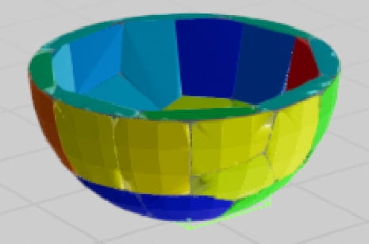

# A Robotic Surface Inspection Framework and Machine-Learning Based Optimal Segmentation for Aerospace and Precision Manufacturing

**Authors:**
- Arun Nandagopal (arunkru@uw.edu)
- Jonas Beachy (jbeachy@uw.edu)
- Colin Acton (actonc@uw.edu)
- Xu Chen (chx@uw.edu) - *Corresponding author*

**Affiliation:**
University of Washington  
3900 E Stevens Way NE  
Seattle, Washington 98195, USA

**Journal:** Journal of Manufacturing Systems

## Abstract

Quality control is key in the advanced manufacturing of complex parts. Modern precision manufacturing must identify and exclude parts with visual imperfections (e.g., scratches, discolorations, dents, tool marks, etc.) to ensure compliant operation. This inspection process -- often manual -- is not only time-consuming but also burdensome, subjective, and requires months to years of training, particularly for high-volume production operations.

A reliable robotic visual inspection solution, however, has been hindered by the small defect size, intricate part characteristics, and demand for high inspection accuracy. This paper proposes a novel automated inspection path planning framework that addresses these core hurdles through four innovations: camera-parameter-based mesh segmentation, ray-tracing viewpoint placement, robot-agnostic viewpoint planning, and Bayesian optimization for faster segmentation. The effectiveness of the proposed workflow is tested with simulation and experimentation on a robotic inspection of heterogeneous complex geometries.

**Keywords:** precision manufacturing, robotic inspection, Bayesian optimization, mesh segmentation, viewpoint generation

## 1. Introduction

In the aerospace industry, meticulous visual inspection is crucial in ensuring flight safety. Even minor flaws such as scratches and dents in critical components like stator vanes can have catastrophic consequences, including airflow imbalances, premature fatigue failure, and potential loss of life.

As the demand for quality-assured aerospace components skyrockets, inspection becomes a bottleneck hindering industrial throughput. Manual inspection processes are not only costly and time-consuming, but also laborious, subjective, and reliant on extensive training. In fact, human inspectors exhibit an accuracy rate of only around 75% in inspecting precision parts.

Several sub-millimeter defect classification methods and robotic image-capturing systems exist, but high-level automation remains largely absent in the aerospace industry due to its high-mix, low-volume (HMLV) manufacturing nature. This necessitates expert reprogramming of inspection systems, which involves manually identifying the locations where the camera needs to be placed using camera-based segmentation of the part and followed by teaching the robot to visit those locations. This process is neither error-proof nor easily reproducible with a new robot or a part.

Therefore to reach rapid manufacturing and quality assurance in aerospace, an agile robotic inspection framework adaptable to diverse part specifications encompassing shape complexity, material variations, and defect detection criteria, is critical. Key features of such a framework include:

- Complete surface coverage for diverse geometries
- Occlusion-free image capture
- Optimal number of imaging locations (viewpoints)
- In-focus image acquisition
- Generalizability to different robots
- Efficient scalability to large parts

Building on previous experiences of working with complex geometries, this paper proposes a novel framework that addresses the core features of agile robotic visual inspection through four innovations: camera-parameter-based mesh segmentation, ray-tracing viewpoint placement, robot-agnostic viewpoint planning, and Bayesian Optimization (BO) for efficient segmentation.


The proposed framework capitalizes on two algorithmic contributions:

**First algorithmic contribution** relates to the challenge of capturing a part's entire surface from optimal viewpoints in inspection. Manual selection of the viewpoints to collect data is time-consuming and imprecise. On the other hand, existing automated approaches such as identification of flat surfaces using normal vector data of triangles and geometric feature analysis, do not address self-occlusion, meaning certain areas of the part cannot be imaged due to obstruction by its own surface.

This paper proposes a novel, efficient, and flexible solution using unsupervised machine learning for viewpoint generation and 3D model segmentation. The proposed methodology integrates unsupervised machine learning through K-means clustering and utilizes the camera's intrinsic model to determine cluster sizes effectively within the Depth of Field (DOF) and Field of View (FOV).

**Second algorithmic contribution** addresses the challenge of systematically determining the number of inspection segments. This paper investigates two methods, exponential search, and BO, to find the optimal K value for segmentation based on a quality evaluation index using camera model metrics. BO, in particular, allows for understanding the K-means clustering output and helps predict the right K value with minimal clustering attempts.

## 2. Methodology

### 2.1 Overall Workflow


The proposed process for calculating viewpoints for imaging a part involves several key stages:

The pipeline starts by taking in a surface model in mesh file formats such as STL and OBJ, along with parameters that describe a camera model, such as the camera sensor length and width, magnification, and aperture values. These parameters are used to determine the camera's field of view (FOV) and depth of field (DOF).

**Step 2:** Two procedures are performed. The Pointcloud Resampling procedure transforms the STL model into a point cloud via Poisson-disk sampling. Then, the algorithm employs Camera-based K-means Segmentation to obtain segments of the generated point cloud that fall within the camera's FOV and DOF.

The number of segments derived is directly related to the camera model described. For example, for a flat surface, the number of segments derived will be directly proportional to the FOV area and does not depend on the DOF value. For a curved surface, the number of segments is again directly proportional to the field of view but indirectly proportional to the DOF.

Resampling the surface of a mesh file is crucial for three main reasons:
1. It helps eliminate symmetry in points for symmetrical objects like spheres or cubes
2. Resampling addresses issues with the high density of triangular surfaces around vertices
3. It provides control over determining the point density based on the camera's FOV requirements

**Step 3:** Once the part is divided into segments suitable for imaging, the local geometric properties of each point in the segment are utilized to calculate the position and orientation of the viewpoint. This involves computing the average of the normal vectors for each point to obtain the mean normal vector.

**Step 4:** Involves optimizing the viewpoint position and orientation to avoid occlusion by regions of the part itself. After occlusion avoidance, these viewpoints are ordered and categorized for inspection using a robotic imaging system.

Finally, the robot is commanded to move to these viewpoints to capture in-focus images covering the entire surface of the part.

### 2.2 Mesh Segmentation Algorithm

The algorithm builds upon the common Lloyd's algorithm segmentation technique (commonly referred to as K-means Clustering) and expands to integrate constraints on part geometry, exponential search, and BO. Additionally, camera parameters including the FOV and DOF are incorporated to ensure that the resulting clusters produce well-focused images.


The proposed workflow consists of two segmentation stages:
1. Initial stage involves segmenting the part into planar segments that fall within the camera's DOF
2. Subsequent stage consists of segmenting these planar segments into regions falling within the FOV

To perform mesh segmentation using the K-means algorithm, a collection of data points and a method to find an optimal K value are essential. The data points are obtained from the geometric characteristics of the individual points within the point cloud produced during the resampling phase.

To derive the planar segments, a feature matrix is constructed by normalizing the coordinates x_i, y_i, and z_i to x_i', y_i', and z_i' such that each coordinate falls within the closed interval [-1, 1]:

```
x_i' = -1 + 2 * ((x_i - x_min) / (x_max - x_min))
```

Subsequently, a vector [x_i', y_i', z_i', u_i', v_i', w_i'] is constructed for each i-th point in the point cloud, where u_i', v_i', w_i' are the unit normals at each point.

The K-means Clustering algorithm applied to the feature matrix has the following process:

1. **Initialization of K Centroids:** Initialize K centroids by sampling from the feature vectors
2. **Cluster Assignment:** For each vector in the feature matrix, assign it to the nearest centroid
3. **Centroid Update:** Update each centroid by computing the mean of all points assigned to that centroid
4. **Convergence Check:** Repeat steps 2 and 3 until convergence

For planar segmentation, exponential search is preferred when the bounds of K are uncertain:

1. **Initialization:** Set the initial upper bound as K = 1
2. **Exponential Range Expansion:** Double the upper bound until the segmentation produces clusters which satisfy the evaluation function
3. **Binary Search:** Perform a binary search in the found range

### 2.3 Optimal Search of Imageable Point Clusters With Bayesian Optimization

To efficiently segment a part into the optimal K number of partitions that satisfy the FOV and DOF requirements of the camera, one must minimize the number of evaluations of different K values. This becomes extremely expensive to assess the field of view requirements at large K values.

#### Cost Function Selection

The optimal segmentation occurs when all points within each partition are confined to the camera's field of view (FOV) while minimizing the number of clusters, K. The objective is to design a cost function that is convex, with its minimum corresponding to the optimal K value.


**Point-based cost function:**

The constraint violation percentage (CV) is:

```
CV = (1/n) * Σ(#points(i)_out / (#points(i)_in + #points_out))
```

The packing efficiency (PE) is calculated via:

```
PE = (1/n) * Σ(#points(i)_in / Max#points_in)
```

The cost function is:

```
f(K) = λ × CV + φ × (1/PE)^β
```

where λ, β, and φ are positive numbers.

#### Bayesian Optimization

With the developed cost function, Bayesian Optimization (BO) is applied as a surrogate-model-based approach to find the optima of the cost f(K). The surrogate model utilized for this problem was the Gaussian Process (GP).

A GP is denoted as:

```
f*(K) ~ GP(μ(K), Cov(K, K'))
```

The covariance function for given two arbitrary K values (K_i, K_j) is:

```
Cov(K_i,K_j) = exp(- ||K_i-K_j||^2 / (2ℓ^2))
```

The Expected Improvement (EI) acquisition function is used:

```
α_n^EI(K_i) = E[max{0, f(K_min) - f*_{n+1}(K)}]
```

### 2.4 Occlusion Avoidance

For each formed cluster of points across the surface, a viewpoint is formed by projecting a point from the center of the cluster by the focal distance of the camera in the direction of the average normal of the set of points. For convex surfaces, the resulting viewpoint will properly capture the desired surface area; however, projecting viewpoints from concave surfaces can often lead to perspectives occluded by other facets of the part.

A novel method of viewpoint adjustment using ray casting was developed. Each projected viewpoint is tested for occlusion by casting a ray from the viewpoint to each surface point in its corresponding cluster. If the distance traveled by any of the rays does not match the distance from the viewpoint to the surface point within a certain tolerance ε, the viewpoint is considered to be occluded.


New candidate viewpoints are progressively generated and tested within the spherical cap defined by angle θ_max from the z-axis. The search domain is swept by progressively increasing θ from the apex of the cap and testing points sampled uniformly along the circumference of the circle.

### 2.5 Viewpoint Clustering and Traversal

Viewpoints generated for any given part can be categorized into six regions: top, bottom, left, right, front, and back. To efficiently facilitate the automatic clustering of viewpoints, another layer of K-means clustering is utilized. With the precise number of regions known (i.e., six regions), the value for K is specified as 6.

For traversing the viewpoints within a particular region, a systematic approach is adopted. The points are sorted from the bottom to the top, ensuring a structured progression. In cases where points possess similar heights from the bottom, the leftmost point is prioritized.

## 3. Results

### 3.1 Mesh Segmentation Algorithm for Different Geometries

A qualitative analysis of the segmentation algorithm was conducted to evaluate its performance across various geometries. The geometries selected for evaluating the algorithm were carefully curated to serve as a future benchmark. These geometries were derived using various methods, including TinkerCAD for some shapes and public sources like GrabCAD for others.

To maintain consistency, the surface area of all these meshes was kept within 10% of 2400 square millimeters. Additionally, the area of the image captured was set to 133 square millimeters.

The camera parameters remained constant for all parts:
- Sensor width = 35.70 mm
- Sensor height = 23.80 mm
- Sensor width = 9504 px
- Sensor height = 6336 px
- Magnification = 1:3
- ROI Pixels = 1200 px × 1200 px
- ROI Area = 11.54 mm × 11.54 mm
- Depth of field = 4 mm
- Segment FOV circular diameter = 11.54 mm
- Spatial resolution = 10 μm
- Minimum defect size detectable = 100 μm

**Results Summary:**

Images for each shape in the table:
     <!-- 
     
     
     
     
      -->
<table style="width: 100%; table-layout: fixed;">
  <tr>
    <td style="width: 16.67%; text-align: center; padding: 10px;">
      
      <br><strong>Wing</strong>
    </td>
    <td style="width: 16.67%; text-align: center; padding: 10px;">
      
      <br><strong>Cylinder</strong>
    </td>
    <td style="width: 16.67%; text-align: center; padding: 10px;">
      
      <br><strong>Ring</strong>
    </td>
    <td style="width: 16.67%; text-align: center; padding: 10px;">
      
      <br><strong>Bulkhead</strong>
    </td>
    <td style="width: 16.67%; text-align: center; padding: 10px;">
      
      <br><strong>Sphere</strong>
    </td>
    <td style="width: 16.67%; text-align: center; padding: 10px;">
      
      <br><strong>T-stiffener</strong>
    </td>
  </tr>
</table>


| Shape | Name | PE | # VP | Time (secs) |
|-------|------|-----|------|-------------|
| Wing | Wing | 0.556 | 44 | 11 |
| Cylinder | Cylinder | 0.54 | 49 | 11.5 |
| Ring | Ring | 0.48 | 55 | 11.7 |
| Bulkhead | Bulkhead | 0.47 | 59 | 14.3 |
| Sphere | Sphere | 0.41 | 60 | 17 |
| T-stiffener | T-stiffener | 0.35 | 76 | 24 |

### 3.2 Efficiency of Clustering

The packing efficiency metric offers insight into the segmentation effectiveness for each shape. Parts with extensive flat surfaces, such as the wing and the cylinder, achieve efficiencies surpassing 0.5. Conversely, shapes with pronounced curvature, such as spheres, rings, and bulkheads, demonstrate packing efficiencies ranging from 0.4 to 0.5.

### 3.3 Bayesian Optimization to Find K for Different Planar Segments

The efficiency of the BO for the search for minimum viable K was tested on various shapes. The BO consistently outperformed the exponential search for the fewest evaluations of the field of view check.


**Performance Evaluation:**

| Shape | Area (mm²) | FOV (mm²) | CV % | BO Iterations | Exp Search Iterations |
|-------|------------|-----------|------|---------------|----------------------|
| Triangle | 53865 | 290 | 0.01 | 5 | 18 |
| Hexagon | 53865 | 1161 | 0.220 | 8 | 14 |
| Decagon | 11317 | 290 | 0.19 | 9 | 13 |
| Square | 400 | 10.7 | 0.22 | 8 | 12 |

### 3.4 Optimal K Value Search Method Time Comparison

A sphere was utilized as the test subject to evaluate the performance of exponential search and BO methods in determining the optimal K value. The analysis revealed that exponential search outperformed BO for K values within the range of 1 to 5, but beyond this range, BO demonstrated superior efficacy. As the optimal K value increased to 195, the time disparity between the two methods approached approximately 100 seconds.


### 3.5 Imaging a Part

A 3D-printed hollow cylinder with a diameter of 75 mm and a height of 50 mm served as the test subject for actual viewpoint traversal and inspection. The part was randomly marked to simulate defects, and after inspection, detailed images of these markings were identified, indicating complete coverage of the part's surface.

The results demonstrated the system's capability to capture defects on:
- Outside surface
- Top edge  
- Inner surface


     
     


### 3.6 Comparison with Manual Robotic Inspection Setup

The proposed segmentation algorithm represents a significant advancement in setup time compared to current automated inspection solutions, which typically involve teaching robots to move to specific locations in space based on required images. With traditional methods, setup time increases linearly as the number of imaging regions grows, and segmentation becomes challenging for parts with highly complex surface profiles or large sizes.

The segmentation algorithm addresses these challenges by streamlining the inspection process. It eliminates the need for manual teaching, thereby reducing setup time significantly and making segmentation feasible for complex parts. By automating the segmentation process, it enhances scalability and reduces the likelihood of errors associated with manual intervention.

## 4. Limitation and Future Work

### 4.1 Limitations

Even though the field of mesh segmentation is vast and many solutions exist for different applications, when the general surface inspection problem is considered, it is difficult to arrive at a universal solution. This problem can be compared to the automated spray-painting problem where the goal is to derive waypoints and a path for optimal paint layer covering of any given CAD model.

With regard to the proposed algorithm, there are a few known limitations:

- K-means is a non-deterministic algorithm – applying this process to the same object multiple times would result in different segments
- The ability to deal with small edges as in the case of the T-stiffener, where the packing efficiency falls significantly short

### 4.2 Future Work

A few aspects of the algorithm have room for improvement:

- The nature of repetitive segmentation to avoid local minimum can be avoided by using K-means++ method of initialization
- Small edges are challenging to inspect and could be improved by using methods such as region-growing algorithms
- Modern deep learning techniques could be explored to train a neural network to segment parts that satisfy the camera parameters

## 5. Conclusion

This paper presents an agile surface inspection framework that leverages unsupervised machine learning for viewpoint generation and path planning tailored for aerospace-grade components. The proposed approach allows the aerospace industry to deploy a single robotic system for inspecting a variety of parts, significantly reducing the high costs associated with expert robot programming and prototyping.

Unlike existing camera and surface model-based methods, the algorithm achieves complete coverage (100%) of complex parts, such as bulkheads, by employing unsupervised machine learning in conjunction with a ray-tracing viewpoint placement strategy. The framework scales effectively with part geometry, demonstrating up to a five-fold speed improvement over traditional exponential search methods due to its integration of Bayesian Optimization.

Validation of the framework was performed using a robotic inspection cell and complex, curved geometries of varying sizes. The results confirm the framework's versatility across a broad spectrum of shapes and its efficiency in detecting defects based on surface models and camera parameters.

## Acknowledgements

The authors would like to thank Shatil Sinha, Matt Hockemeyer, and Anirban Sinha at GE Aerospace (on the manufacturing background), and Sangyoon Back at the University of Washington (robotic integration). The views and conclusions contained in this document are those of the authors and should not be interpreted as representing the official policies, either expressed or implied, of the Office of the Secretary of Defense or the U.S. Government.

## Declarations

A preliminary version of this work is to be presented at the ASME 2024 International Symposium on Flexible Automation (ISFA).

---

*Note: This document has been converted from LaTeX to Markdown. All image references have been commented out to prevent compilation errors but preserved for reference. The original LaTeX formatting for equations and special characters has been simplified for Markdown compatibility.*